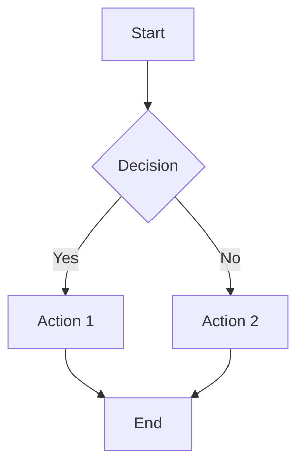

# ERIFY™ Documentation Assets

This directory contains visual assets, diagrams, and supporting materials for the ERIFY™ luxury fintech ecosystem documentation.

## 📁 Asset Directory Structure

```
/docs/assets/
├── README.md           - This file, asset directory overview
├── diagrams.md         - Comprehensive visual diagrams and charts
└── workflows.md        - User journey and process flow diagrams
```

## 📊 Available Assets

## 📊 Available Assets

### Architecture Diagrams
- **System Architecture Overview**: Complete ecosystem layer structure
- **VIP Referral Network Hierarchy**: Membership tier visualization
- **Technology Stack Diagrams**: Frontend, backend, and integration layers
- **Data Flow Architecture**: Information processing and distribution

### Workflow Diagrams
- **User Onboarding Journey**: VIP member acquisition process
- **Daily Engagement Loop**: Member activity workflows
- **Referral Process Flow**: Network growth mechanics
- **Security & Compliance Flow**: Authentication and validation processes

### Brand Visual Assets
- **Color Palette Structure**: Complete color system hierarchy
- **Logo Usage Structure**: Brand asset organization
- **Component Relationships**: UI design system connections
- **Typography Scale**: Font system and hierarchy

### Business Process Maps
- **Ecosystem Data Flow**: Information processing pipeline
- **Member Journey Mapping**: End-to-end user experience
- **Network Growth Visualization**: Referral expansion dynamics
- **Performance Metrics Dashboard**: KPI and analytics structure

## 🎨 Visual Design Standards

### Diagram Aesthetics
- **Style**: Clean, professional, luxury-focused
- **Colors**: ERIFY™ brand palette compliance
- **Typography**: Consistent with brand guidelines
- **Layout**: Structured, hierarchical, easy to understand

### ASCII Art Standards
```
Box Drawing Characters:
┌─┐ ├─┤ └─┘ ┬─┴ ╔═╗ ╠═╣ ╚═╝ ╦═╩

Icons and Symbols:
🌟 (Innovation) 💎 (Luxury) 🔥 (Energy) 👑 (VIP)
📊 (Analytics) 🔐 (Security) 💰 (Wealth) 🚀 (Growth)
```

### Technical Specifications
- **Format**: Markdown with ASCII art and Unicode
- **Compatibility**: GitHub, documentation systems, plain text
- **Scalability**: Responsive to different screen sizes
- **Accessibility**: Screen reader compatible descriptions

## 📋 Usage Guidelines

### Documentation Integration
```markdown
<!-- Include architecture diagram -->


<!-- Reference workflow -->
See [User Journey Flow](./docs/assets/workflows.md#vip-member-onboarding-journey)
```

### Asset Naming Convention
```
Asset Type: [diagram-type]-[component]-[version]
Examples:
- architecture-overview-v1
- workflow-onboarding-v2
- network-hierarchy-v1
- brand-palette-v1
```

### Version Control
- **Source Control**: All assets tracked in Git
- **Version Tags**: Semantic versioning for major updates
- **Change Log**: Document significant modifications
- **Archive**: Maintain previous versions for reference

## 🔄 Mermaid Diagram Support

All workflow diagrams include Mermaid.js syntax for enhanced visualization:



### Integration Examples
- **GitHub**: Native Mermaid rendering in markdown
- **Documentation Sites**: Gitiles, Sphinx, MkDocs support
- **Export Options**: PNG, SVG, PDF generation available

## 📐 Diagram Categories

### 1. Architecture Diagrams
**Purpose**: Technical system structure visualization
**Audience**: Developers, architects, technical stakeholders
**Detail Level**: High-level to component-specific

### 2. Workflow Diagrams  
**Purpose**: Process flow and user journey mapping
**Audience**: Product managers, UX designers, business analysts
**Detail Level**: Step-by-step process documentation

### 3. Business Diagrams
**Purpose**: Ecosystem relationships and business model
**Audience**: Executives, investors, strategic partners
**Detail Level**: Strategic overview with key metrics

### 4. Brand Diagrams
**Purpose**: Visual identity and design system structure
**Audience**: Designers, marketers, brand managers
**Detail Level**: Comprehensive brand asset organization

## 🎯 Asset Applications

### Documentation
- **Technical Specs**: Architecture and system design
- **User Guides**: Onboarding and feature workflows
- **Business Plans**: Ecosystem strategy and growth plans
- **Brand Guidelines**: Visual identity and usage standards

### Presentations
- **Investor Pitches**: Business model and growth metrics
- **Technical Reviews**: Architecture and implementation plans
- **Team Meetings**: Process flows and project updates
- **Client Presentations**: Platform capabilities and benefits

### Development
- **System Design**: Architecture planning and documentation
- **Feature Planning**: User journey and workflow mapping
- **Testing**: Process validation and quality assurance
- **Training**: Team onboarding and knowledge transfer

---

*Visual assets and diagrams supporting comprehensive ERIFY™ ecosystem documentation*

**© 2025 ERIFY™. All rights reserved.**
```
┌─────────────────────────────────────────────────────────────────┐
│                    ERIFY™ ECOSYSTEM                            │
├─────────────────────────────────────────────────────────────────┤
│  🌟 Presentation Layer                                         │
│  ┌─────────────────┐ ┌─────────────────┐ ┌─────────────────┐  │
│  │   Web Portal    │ │   Mobile App    │ │    ERIVOX       │  │
│  │   (Supreme 4)   │ │   (Premium)     │ │   (Community)   │  │
│  └─────────────────┘ └─────────────────┘ └─────────────────┘  │
├─────────────────────────────────────────────────────────────────┤
│  💎 API Gateway & Service Layer                               │
│  ┌─────────────────┐ ┌─────────────────┐ ┌─────────────────┐  │
│  │  Authentication │ │   VIP Services  │ │   Referral      │  │
│  │   & Security    │ │   & Rewards     │ │   Management    │  │
│  └─────────────────┘ └─────────────────┘ └─────────────────┘  │
├─────────────────────────────────────────────────────────────────┤
│  🔥 Core Business Logic                                       │
│  ┌─────────────────┐ ┌─────────────────┐ ┌─────────────────┐  │
│  │  Wealth Engine  │ │  Analytics Hub  │ │  Engagement     │  │
│  │  (Premium)      │ │  (Insights)     │ │  Tracking       │  │
│  └─────────────────┘ └─────────────────┘ └─────────────────┘  │
├─────────────────────────────────────────────────────────────────┤
│  💼 Data & Infrastructure Layer                               │
│  ┌─────────────────┐ ┌─────────────────┐ ┌─────────────────┐  │
│  │   Secure Data   │ │   Cache Layer   │ │   External      │  │
│  │   Storage       │ │   (Redis/CDN)   │ │   Integrations  │  │
│  └─────────────────┘ └─────────────────┘ └─────────────────┘  │
└─────────────────────────────────────────────────────────────────┘
```

### VIP Referral Network Structure
```
┌─────────────────────────────────────────────────────────────┐
│                  VIP REFERRAL PYRAMID                      │
├─────────────────────────────────────────────────────────────┤
│  👑 ERIFY™ FOUNDERS                                        │
│  ├── Premium Pioneers (First 100 members)                  │
│  ├── VIP Ambassadors (Network leaders)                     │
│  └── Elite Advocates (Active referrers)                    │
├─────────────────────────────────────────────────────────────┤
│  💎 LUXURY TIER MEMBERS                                    │
│  ├── Diamond Members (High net worth)                      │
│  ├── Platinum Members (Premium users)                      │
│  └── Gold Members (Standard VIP)                           │
├─────────────────────────────────────────────────────────────┤
│  🌟 EMERGING LEADERS                                       │
│  ├── Rising Stars (Growth potential)                       │
│  ├── Network Builders (Active inviters)                    │
│  └── Future VIPs (Qualified prospects)                     │
└─────────────────────────────────────────────────────────────┘
```

## Workflow Diagrams

### User Onboarding Flow
```
Invitation Sources
┌─────────────────┐
│ VIP Referrals   │
│ Partnerships    │
│ Events          │
│ Campaigns       │
└─────────────────┘
         │
         ▼
Initial Screening
┌─────────────────┐
│ Net Worth       │
│ Professional    │
│ Network Quality │
│ Investment      │
└─────────────────┘
         │
         ▼
VIP Application
┌─────────────────┐
│ Background      │
│ Portfolio       │
│ Network         │
│ Status          │
└─────────────────┘
         │
         ▼
Premium Onboarding
┌─────────────────┐
│ Welcome Package │
│ Concierge       │
│ Tutorial        │
│ Network Intro   │
└─────────────────┘
```

### Daily Engagement Loop
```
┌─── Morning Briefing ───┐ ────► ┌─── Portfolio Review ───┐
│ • Market Intelligence  │       │ • Performance Updates  │
│ • VIP Notifications    │       │ • Risk Assessment      │
│ • Network Activity     │       │ • Opportunity Alerts   │
└───────────────────────┘       └───────────────────────┘
         │                                   │
         ▼                                   ▼
┌─── Strategic Planning ──┐ ◄──── ┌─── Investment Actions ──┐
│ • Goal Adjustment       │       │ • Trade Execution       │
│ • Risk Management       │       │ • Asset Allocation      │
│ • Network Expansion     │       │ • Performance Tracking  │
└───────────────────────┘       └───────────────────────┘
```

### Referral Process Flow
```
VIP Member Identification
         │
         ▼
Prospect Research & Qualification
         │
         ▼
Personalized Invitation Creation
         │
         ▼
Invitation Delivery & Follow-up
         │
         ▼
Application Processing
         │
         ▼
Successful Onboarding
         │
         ▼
Referrer Reward Distribution
```

## Technology Stack Diagrams

### Frontend Ecosystem
```
┌─── User Interfaces ───┐
│ • Web Application     │ ────► Supreme 4PW Crown Seal Experience
│ • Mobile Apps         │ ────► Premium Mobile Experience
│ • ERIVOX Platform     │ ────► Community Engagement Hub
└───────────────────────┘
```

### Backend Services
```
┌─── Core Services ───┐
│ • Authentication    │ ────► VIP Access Management
│ • Wealth Engine     │ ────► Portfolio Management
│ • Analytics Hub     │ ────► Performance Tracking
│ • Referral System   │ ────► Network Growth Management
└─────────────────────┘
```

### Integration Layer
```
┌─── External APIs ───┐
│ • Financial Data    │ ────► Real-time Market Intelligence
│ • Payment Systems   │ ────► Secure Transaction Processing
│ • Communication     │ ────► Multi-channel Engagement
│ • Analytics         │ ────► Business Intelligence
└─────────────────────┘
```

## Brand Visual Hierarchy

### Logo Usage Structure
```
ERIFY™ Supreme 4PW Crown Seal
├── Primary Logo (crest-supreme4-full.png)
├── Compact Version (crest-supreme4.png)
├── Web Optimized (crest-supreme4.webp)
└── Scalable Vector (crest-supreme4.svg)

Neon Crown Series
├── GOALLIN (Total commitment)
├── ELITEHUST (Relentless drive)
├── EGO (DC ERIFY THE GREAT)
└── EGGO (ERIFY • GERIZO • ORIGIN)
```

### Color Palette Structure
```
Primary Palette
├── Electric Blue (#11C9FF) - Innovation
├── Premium Gold (#FFD700) - Luxury
├── Energy Orange (#FF6B35) - Passion
├── Deep Space (#0A0B0C) - Foundation
└── Pearl White (#EEF2F6) - Clarity

Supporting Colors
├── Light Blue (#66D9FF) - Accessibility
├── Dark Blue (#0099CC) - Depth
├── Light Gold (#FFE55C) - Highlights
├── Dark Gold (#B8860B) - Elegance
├── Light Gray (#AAB6C2) - Subtlety
└── Dark Gray (#4A5568) - Foundation
```

---

*Diagrams and visual assets supporting the ERIFY™ luxury fintech ecosystem*

**© 2025 ERIFY™. All rights reserved.**