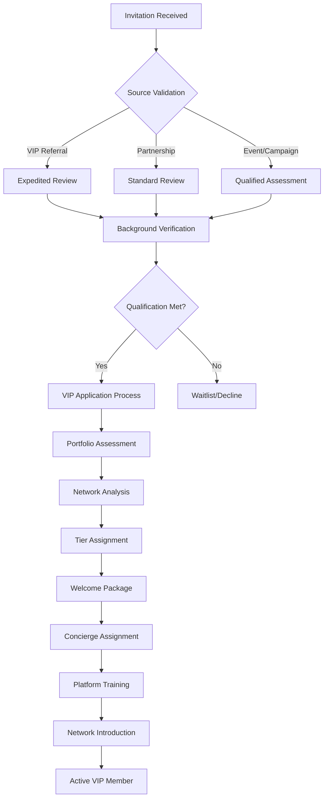
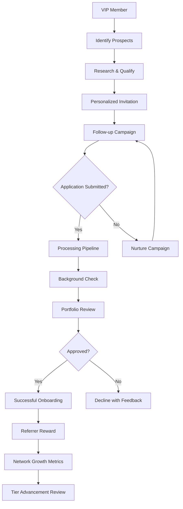
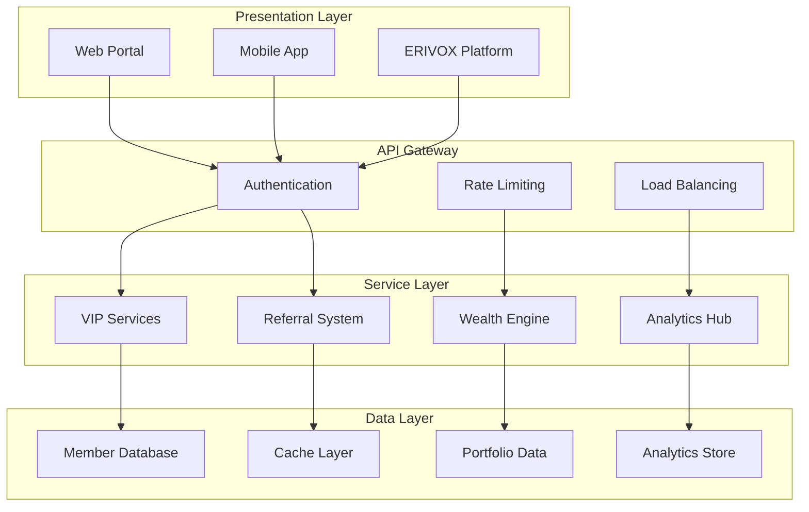
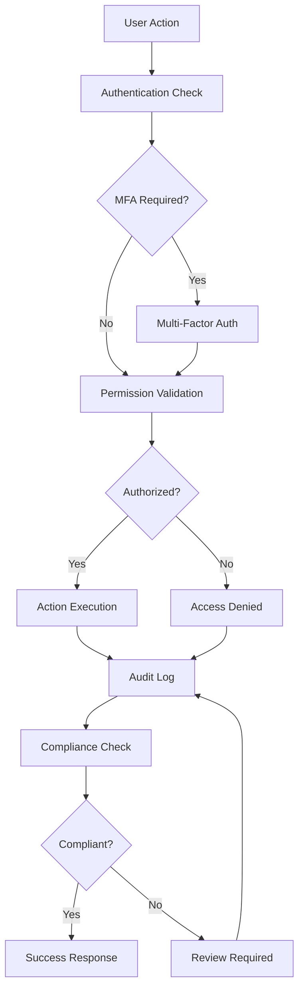

# ERIFY™ User Journey Workflow

## VIP Member Onboarding Journey

```mermaid
graph TD
    A[Invitation Received] --> B{Source Validation}
    B -->|VIP Referral| C[Expedited Review]
    B -->|Partnership| D[Standard Review]
    B -->|Event/Campaign| E[Qualified Assessment]
    
    C --> F[Background Verification]
    D --> F
    E --> F
    
    F --> G{Qualification Met?}
    G -->|Yes| H[VIP Application Process]
    G -->|No| I[Waitlist/Decline]
    
    H --> J[Portfolio Assessment]
    J --> K[Network Analysis]
    K --> L[Tier Assignment]
    L --> M[Welcome Package]
    M --> N[Concierge Assignment]
    N --> O[Platform Training]
    O --> P[Network Introduction]
    P --> Q[Active VIP Member]
```

## Daily Engagement Workflow

```mermaid
graph LR
    A[Morning Login] --> B[Market Brief]
    B --> C[Portfolio Review]
    C --> D[Alerts & Notifications]
    D --> E[Strategic Planning]
    E --> F[Investment Actions]
    F --> G[Network Activity]
    G --> H[Community Engagement]
    H --> I[Performance Tracking]
    I --> J[Evening Summary]
```

## Referral Network Growth

```mermaid
graph TD
    A[VIP Member] --> B[Identify Prospects]
    B --> C[Research & Qualify]
    C --> D[Personalized Invitation]
    D --> E[Follow-up Campaign]
    E --> F{Application Submitted?}
    F -->|Yes| G[Processing Pipeline]
    F -->|No| H[Nurture Campaign]
    H --> E
    
    G --> I[Background Check]
    I --> J[Portfolio Review]
    J --> K{Approved?}
    K -->|Yes| L[Successful Onboarding]
    K -->|No| M[Decline with Feedback]
    
    L --> N[Referrer Reward]
    N --> O[Network Growth Metrics]
    O --> P[Tier Advancement Review]
```

## Platform Architecture Flow

```mermaid
graph TB
    subgraph "Presentation Layer"
        A[Web Portal]
        B[Mobile App]
        C[ERIVOX Platform]
    end
    
    subgraph "API Gateway"
        D[Authentication]
        E[Rate Limiting]
        F[Load Balancing]
    end
    
    subgraph "Service Layer"
        G[VIP Services]
        H[Wealth Engine]
        I[Analytics Hub]
        J[Referral System]
    end
    
    subgraph "Data Layer"
        K[Member Database]
        L[Portfolio Data]
        M[Analytics Store]
        N[Cache Layer]
    end
    
    A --> D
    B --> D
    C --> D
    
    D --> G
    E --> H
    F --> I
    D --> J
    
    G --> K
    H --> L
    I --> M
    J --> N
```

## Security & Compliance Workflow

```mermaid
graph TD
    A[User Action] --> B[Authentication Check]
    B --> C{MFA Required?}
    C -->|Yes| D[Multi-Factor Auth]
    C -->|No| E[Permission Validation]
    D --> E
    
    E --> F{Authorized?}
    F -->|Yes| G[Action Execution]
    F -->|No| H[Access Denied]
    
    G --> I[Audit Log]
    I --> J[Compliance Check]
    J --> K{Compliant?}
    K -->|Yes| L[Success Response]
    K -->|No| M[Review Required]
    
    H --> I
    M --> I
```